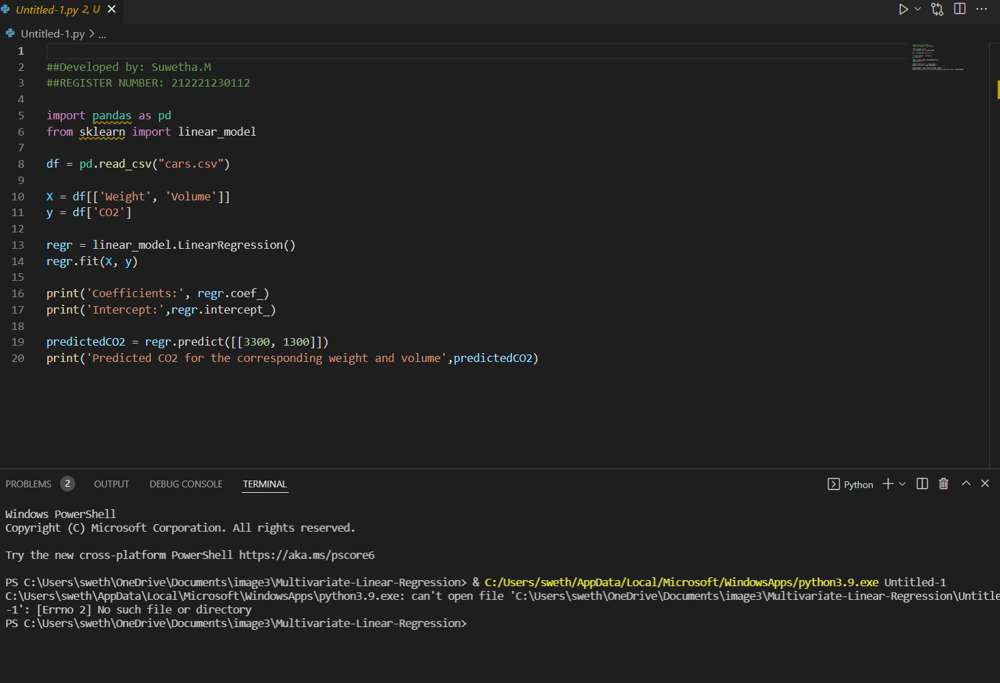

# Implementation of Multivariate Linear Regression
## Aim
To write a python program to implement multivariate linear regression and predict the output.
## Equipment’s required:
1.	Hardware – PCs
2.	Anaconda – Python 3.7 Installation / Moodle-Code Runner
## Algorithm:
### Step1
Import pandas as pd.
 

### Step2
Read the csv file.
 

### Step3
Get the value of X and y variables.
 

### Step4
Create the linear regression model and fit.
 

### Step5
Predict the CO2 emission of a car where the weight is 2300kg, and the volume is 1300cm3.
 

### step6
Print the predicted output.
 
## Program:
### developedby : M.Suwetha
### register no : 212221230112
import pandas as pd
from sklearn import linear_model

df = pd.read_csv("cars.csv")

X = df[['Weight', 'Volume']]
y = df['CO2']

regr = linear_model.LinearRegression()
regr.fit(X, y)

print('Coefficients:', regr.coef_)
print('Intercept:',regr.intercept_)

predictedCO2 = regr.predict([[3300, 1300]])
print('Predicted CO2 for the corresponding weight and volume',predictedCO2)

## Output:

## Result
Thus the multivariate linear regression is implemented and predicted the output using python program.